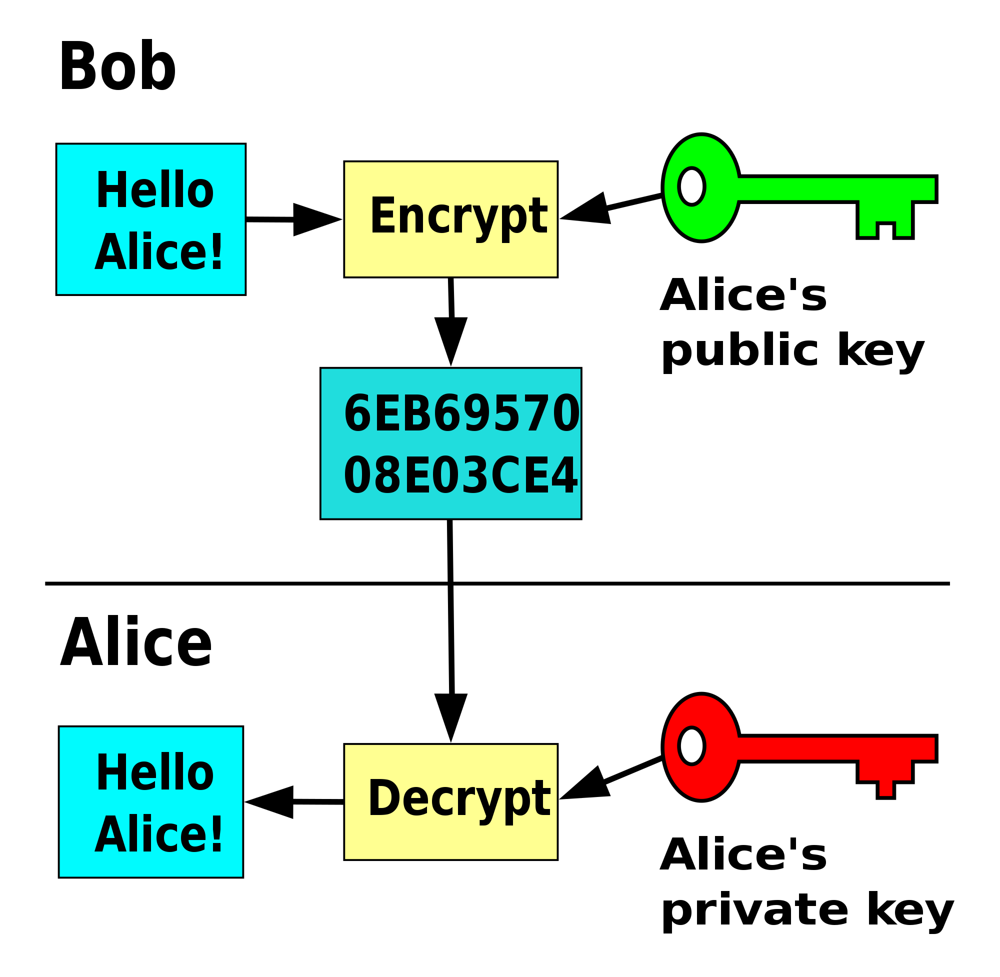
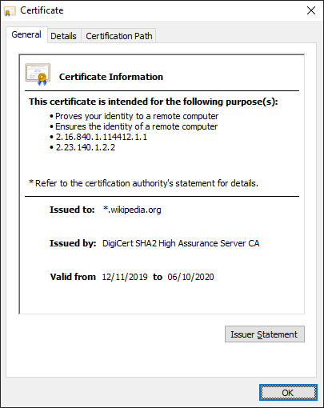
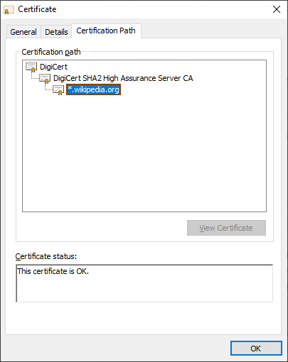
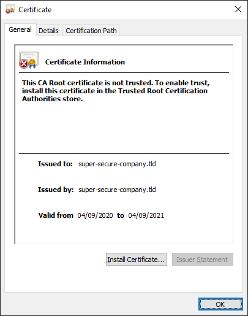
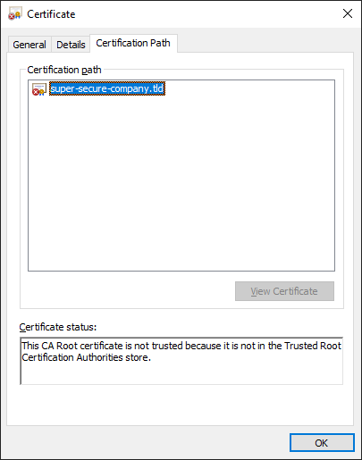
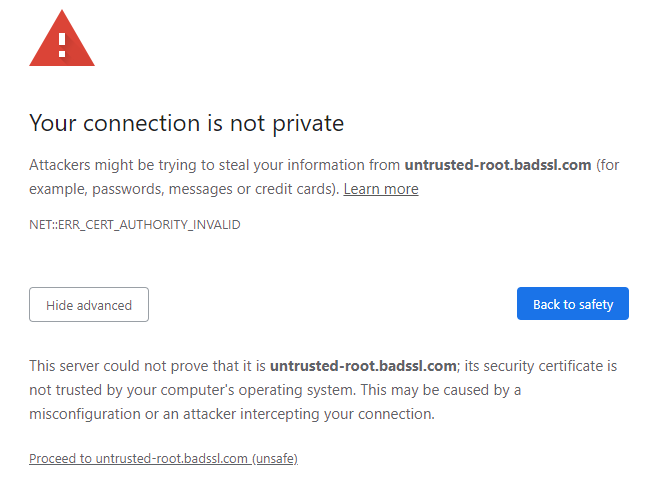
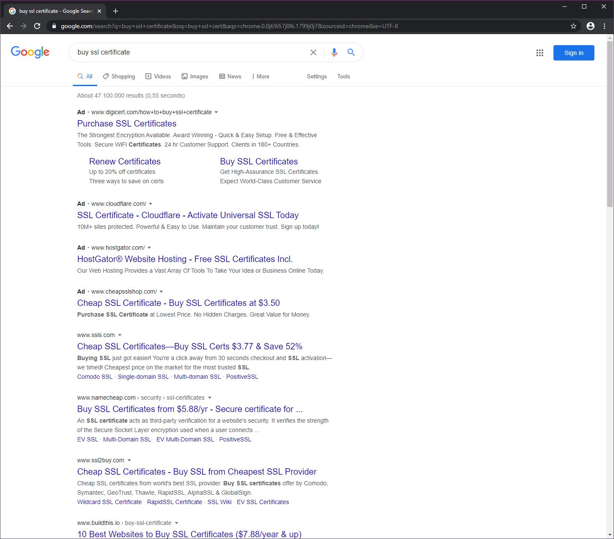
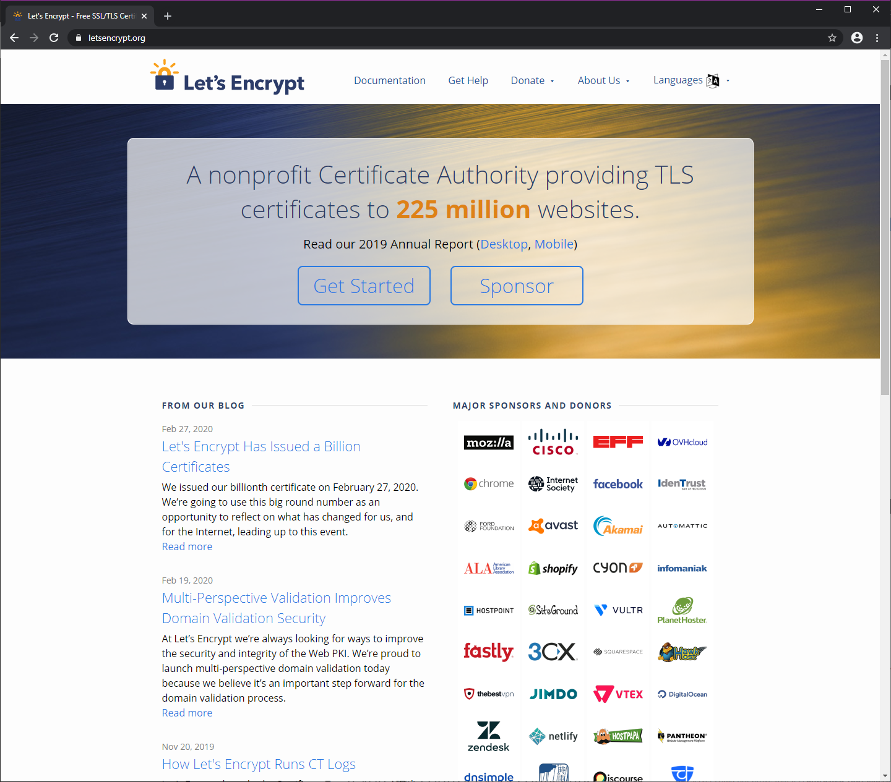
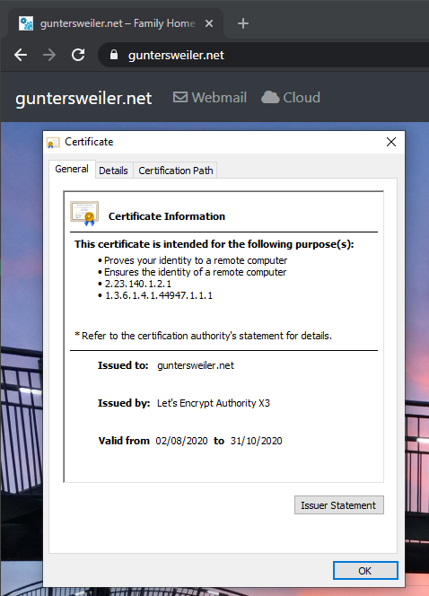
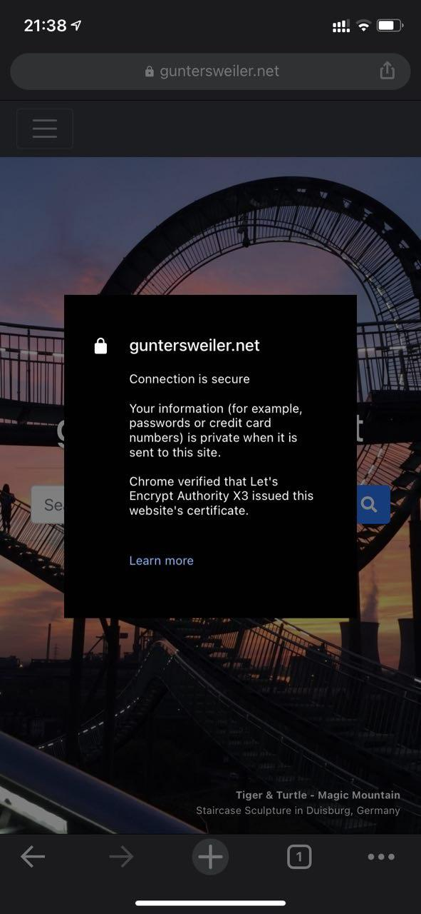

# HTTP+_S_
## Secure Internet Traffic explained quickly

Raphael Guntersweiler
<raphael@guntersweiler.net>

---

# What you're learning today:
- How _public key encryption_ works
- Where _public key encryption_ is used
- How _HTTPS certificates_ works

---

# What you _**won't**_ learn today:
- How to write your own crypto
- The inner workings of public key encryption algorithms
- How to implement HTTPS in your app, service, etc.
- ~~How to hack Facebook, WhatsApp, etc.~~

---

<!-- _class: invert -->


# ⚠ DISCLAIMER!
I am **NOT** a security expert!
I have **NOT** studied cryptography, math, statistics or anything like this!

This is self-taught knowledge during years of professional IT work and operating my own servers on the internet.
Everything in this presentation is **simplified**.

## Rules for your own crypto

When it comes to cryptography, **NEVER BUILD YOUR OWN**!
Use _trusted third-party implementations_ when building anything involving crypto.

---


# 🗝 in Ye Olden Days
- based on a _shared secret_

## Example: ROT13
ROT13 is a Caesar cipher where characters are moved by 13 places in the alphabet.

```
Input:  Hello World
Output: Uryyb Jbeyq
```

Variations apply different rotation.

**⚠ This is insecure! Do not use this!**

---

# Why **Shared Secret Cryptography** doesn't work on the Internet

- How do you share the 🔑?

    > "Lets meet up in the park to exchange the key!", said the _Australian_ to the _Austrian_.

    > "Send it to me via email". _Unencrypted_?

---

# Public Key Cryptography



- uses a pair of keys
    - _Private Key_
    - _Public Key_

- a message is encrypted with the _Public Key_ and decrypted with the _Private Key_

---

# Public Key Cryptography _II_

- Public Keys are shared openly
- Private Keys are kept secret
  they are the _only way_ to decrypt messages

---

# Some Protocols that use "asymmetric key algorithms"

- **S/MIME** / **OpenPGP** - encrypt and sign emails
- **IPsec** - VPN
- **SSH** - remote shell (_command line_)
- **Bitcoin**

_and_
- **SSL** - Secure Socket Layer (_deprecated, insecure_)
- **TLS** - Transport Layer Security

known from **HTTPS**!

---



# 🔐 HTTPS Certificates

- issued to a single domain or a domain wildcard

    > This certificate can be used on `wikipedia.org`, `www.wikipedia.org`, `en.wikipedia.org`, etc.

- signed by a trusted third party
- have limited validity

---

# How HTTPS requests work

1. Client _C_ asks Server _S_ for a web page
2. Server _S_ responds with its _Server Public Key_ (_sPK_), which was signed by _ExampleCA_
3. _C_ validates that _sPK_ was signed by the _ExampleCA_, which it trusts
4. _C_ generates its own key-pair (Public & Private Key, _cPK_)
5. _C_ encrypts its _cPK_ with the _sPK_ and sends it to _S_
6. _S_ now uses _cPK_ to encrypt traffic to _C_

This means that:
- Only _C_ can encrypt traffic encrypted with _cPK_
- Only _S_ can encrypt traffic encrypted with _sPK_
- _C_ and _S_ can both validate that the communication originates from _S_ or _C_ respectively and it has not been changed

---

<!-- _class: invert -->


# How to break it?

---

<!-- _class: invert -->


# Man-in-the-Middle Attack

Middle Man _M_ could intercept the request from _A_ to _B_

_M_ generates its own key-pair and uses it to encrypt the traffic from _A_ and _B_ and forward it afterwards.

_M_ can therefore **read all traffic** from _A_ and _B_ and **even change it**!

The communication channel between _A_ and _B_ is not secure anymore.

---

# How to fix this?

---



# The Web of Trust

- This certificate is signed by "DigiCert SHA2 High Assurance Server CA"
- ... which was signed by "DigiCert"

- Computer trusts "DigiCert" therefore trusts "DigiCert SHA2 ..." and therefore also "*.wikipedia.org"

---




# Things you can't do: **Self-signed Certificates**

- Noone can guarantee me that this certificate is real
- A _trusted_ Certificate Authority (_CA_) has to sign this certificate so it is also trusted

You could install this certificate on your computer so it would trust it. But you should **NEVER** do this!

---

<!-- _class: invert -->


## This means for our attacker _M_:

If _M_ would intercept the traffic and sign the traffic between _A_ and _M_,
_A_ would not trust the certificate if it wasn't signed by a trusted authority.

_A_ would therefore detect that the channel is not secure.

---

## "Legitimate" reasons to do MitM

- Secure Web Proxy at your company
- AV software detecting malware in your HTTPS traffic

## and MitM fails

- The [Lenovo "SuperFish" incident](https://en.wikipedia.org/wiki/Superfish#Lenovo_security_incident)

    > Local HTTP(S) proxy preinstalled on Lenovo to inject ads... what could go wrong?!

---

# Solution: **Roll your own Root Certificate Authority**

I mean, it's simple, right?

1. Generate a Root CA key-pair and sign it
2. Generate an intermediate CA key-pair, sign it with Root CA
3. Generate my own certificates with the intermediate certificate
4. Profit... right?

---

# Things you can't do: **Your own Root Certificate Authority**



Even if you setup your own Root CA:
- every device would have to install your _Root CA certificate_

If you can control every connecting device, you can setup a _Private CA_.
If you want to allow access for other devices, you will need a _Public CA_.

---



# The real solution: **Buy a Certificate**

Depending on the use-case, certificates can cost a few euros

... or a few thousand euros.

The higher the price, the more features you get.
- Wildcard Domains
- S/MIME
- Company Validation
- Extended Validation (EV)

---



# For the "ordinary folk": **LetsEncrypt**

**Free** certificates for websites, trusted by every modern device

_Limitations:_
- expire after 90 days
- require validation through public web or DNS requests (not intranet-suitable)

---





---

# What HTTPS Certificate do and don't

## A certificate **does** guarantee that
- data has been sent by the correct counterparty
- data can't be seen by third parties
- data has not been modified

## A certificate **does NOT** guarantee that
- data is handled or stored securley
- data is not malicous

---

# The Short Summary

- HTTPS certificates ensure secure communicate between two parties using _Public Key cryptography_
- The certificate contains a _Public Key_ that can be used to encrypt traffic and send it to the server
- The server decrypts its traffic using its _Private Key_
- The client does the same with its own key-pair
- The server has to present a certificate which the client trusts
