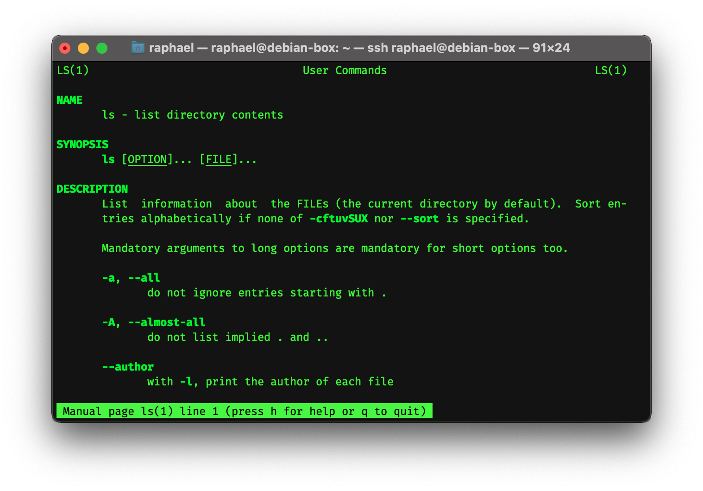

# Linux Command Line 101
## An introduction into the world of Linux

Raphael Guntersweiler
<raphael@guntersweiler.net>

---

# Content of this presentation
- First login
- File system
- Good to know programs
- The Administrator
- Installing new programs (the Linux way)

## ⚠️ Disclaimer
This presentation is geared towards people who haven't used Linux either at all or not a lot. Some best practises might not be followed, some things might be simplified.

We're using the _Debian / Ubuntu_ distribution (mostly due to personal preference). Other flavours exist but most of this presentation still applies.

---

<!-- _class: invert -->

# First login

---

# First login
```
raphael@debian-box:~$ _

|_____| |________| |
   |         |     |
   |         |     +-- Your current location (i.e. "~")
   |         +-------- Your machines name
   +------------------ Your username
```

---

## **First Login**: RTFM

For (almost) every command there exists a man-page (manual).

```
man <command>
```



---

## **First Login**: What is in my directory?
```
raphael@debian-box:~$ ls
another-textfile.txt  file.txt
```

---

## **First Login**: What is in my directory?
```
raphael@debian-box:~$ ls -l
total 5
-rw-r--r-- 1 raphael raphael  0 Dec  7 02:20 another-textfile.txt
-rw-r--r-- 1 raphael raphael 20 Dec  7 02:19 file.txt

||_______|   |_____| |_____|  | |__________| |
|   |           |       |     |       |      |
|   |           |       |     |       |      +- File name
|   |           |       |     |       +-------- Last modified
|   |           |       |     +---------------- File size (bytes)
|   |           |       +---------------------- Owner group
|   |           +------------------------------ Owner
|   +------------------------------------------ File permissions
+---------------------------------------------- File type
```

---

## **First Login**: Navigate through file system
```
cd <destination>
```

```
raphael@debian-box:~$ ls -l
total 5
drwxr-xr-x 2 raphael raphael  3 Dec  7 02:26 Documents
-rw-r--r-- 1 raphael raphael 12 Dec  7 02:22 another-textfile.txt

# Navigate to the Documents directory
raphael@debian-box:~$ cd Documents

raphael@debian-box:~/Documents$ ls -l  
total 5
-rw-r--r-- 1 raphael raphael 20 Dec  7 02:19 file.txt
```

Notice that in the directory listing (`ls -l`) "Documents" had a `d` in the File permissions column prefixed.

---

## **First Login**: Manipulating files
### Copy a file
```
cp <source> <destination>
```

```
raphael@debian-box:~$ ls -l
total 5
drwxr-xr-x 2 raphael raphael  3 Dec  7 02:26 Documents
-rw-r--r-- 1 raphael raphael 12 Dec  7 02:22 another-textfile.txt

raphael@debian-box:~$ cp another-textfile.txt another-textfile.copy.txt

raphael@debian-box:~$ ls -l 
total 10
drwxr-xr-x 2 raphael raphael  3 Dec  7 02:26 Documents
-rw-r--r-- 1 raphael raphael 12 Dec  7 02:30 another-textfile.copy.txt
-rw-r--r-- 1 raphael raphael 12 Dec  7 02:22 another-textfile.txt
```

---

## **First Login**: Manipulating files
### Move / rename a file
```
mv <source> <destination>
```

```
raphael@debian-box:~$ ls -l 
total 10
drwxr-xr-x 2 raphael raphael  3 Dec  7 02:26 Documents
-rw-r--r-- 1 raphael raphael 12 Dec  7 02:30 another-textfile.copy.txt
-rw-r--r-- 1 raphael raphael 12 Dec  7 02:22 another-textfile.txt

raphael@debian-box:~$ mv another-textfile.copy.txt copied-textfile.txt

raphael@debian-box:~$ ls -l
total 10
drwxr-xr-x 2 raphael raphael  3 Dec  7 02:26 Documents
-rw-r--r-- 1 raphael raphael 12 Dec  7 02:22 another-textfile.txt
-rw-r--r-- 1 raphael raphael 12 Dec  7 02:30 copied-textfile.txt
```

---

## **First Login**: Manipulating files
### Move / rename a file II

```
raphael@debian-box:~$ ls
Documents  another-textfile.txt  copied-textfile.txt

raphael@debian-box:~$ ls Documents/
file.txt

raphael@debian-box:~$ mv copied-textfile.txt Documents/

raphael@debian-box:~$ ls 
Documents  another-textfile.txt

raphael@debian-box:~$ ls Documents/
copied-textfile.txt  file.txt
```

---

## **First Login**: Manipulating files
### Delete a file

```
rm <file>
```

⚠️ There is no "Recycle Bin". Once you use `rm`, the file is gone!

```
raphael@debian-box:~/Documents$ ls
copied-textfile.txt  file.txt

raphael@debian-box:~/Documents$ rm copied-textfile.txt 

raphael@debian-box:~/Documents$ ls
file.txt
```

---

## **First Login**: Manipulating files
### Delete a file II

⚠️ How to *destroy* your computer with one command
**Please never run this or everything on or attached to your computer is being deleted.**
```
rm -rf /
 |  || |
 |  || +- The root directory of your system (see FS explanation)
 |  |+--- Force everything, do not ask for confirmation
 |  +---- Recursive
 +------- Remove file / directory
```

---

## **First Login**: Manipulating files
### A few more commands

Create a new directory
```
mkdir <name>
```

Create a new blank file
```
touch <filename>
```

Open file in text editor
```
nano <filename>
```
```
vi <filename>
```

---

<!-- _class: invert -->

# The Linux File System

---

## Linux File System
- File system uses a common root: `/`
- Everything on your computer is somewhere in or under `/`
- On Linux, everything is a "file"; even your keyboard, your mouse, your webcam

- There are _no "drive letters"_; drives are mounted in directories under `/`

---

## **Linux File System**: Some of the most important directories
- `/bin` Essential binaries
- `/dev` Device files
- `/etc` Config files
- `/home` Home directories for all users
- `/lib` Shared libraries
- `/media` + `/mnt` Mountpoints for removable / temporary media / file systems
- `/root` Home directory
- `/sbin` Essential system binaries
- `/tmp` Temporary files
- `/usr` Secondary tree for files (usually also contains `bin`, `sbin`, etc.)
- `/var` Variable data (i.e. log files)

---

## **Linux File System**: `~` ("_tilde_")
The `~` directory is a shortcut to the current users home directory, usually `/home/<username>` (or `/root`).

---

<!-- _class: invert -->

# Permission System

---

## Unix File Permissions

```
raphael@debian-box:~$ ls -l
total 10
drwxr-xr-x 2 raphael raphael  3 Dec  7 02:35 Documents
-rw-r--r-- 1 raphael raphael 12 Dec  7 02:22 another-textfile.txt
-rw-r--r-- 1 root    raphael 19 Dec 10 23:02 test.sh
 |_______|   |_____| |_____|
     |          |       +------ Owner Group
     |          +-------------- Owner User
     +------------------------- File Permissions
```

**`r`**/**`4`** Read | **`w`**/**`2`** Write | **`x`**/**`1`** Execute

---

## Unix File Permissions

```
-rw-r--r-- 1 root    raphael 19 Dec 10 23:02 test.sh
 |_||_||_|
  |  |  +----- Other / Everyone
  |  +-------- Owner Group (i.e. raphael)
  +----------- Owner User (i.e. root)
```

---

## Unix File Permission: Octal Representation
```
-rw-r--r-- 1 root    raphael 19 Dec 10 23:02 test.sh
 |_||_||_|
  |  |  +----- 4
  |  +-------- 4 ==> 644
  +----------- 6
```

---

## Changing File Permissions
```
raphael@debian-box:~$ ls -l file.txt
-rw-r--r-- 1 raphael raphael 0 Dec 13 17:07 file.txt

raphael@debian-box:~$ chmod 600 file.txt
```
`600` => Owner: `rw`; Group: `-`; Everyone: `-`
```
raphael@debian-box:~$ ls -l file.txt
-rw------- 1 raphael raphael 0 Dec 13 17:07 file.txt
```

_In this example, only the owner will have permission to read and write `file.txt`. Everyone else will not._

---

## Changing File Permissions
```
raphael@debian-box:~$ ls -l file.txt
-rw-r--r-- 1 raphael raphael 0 Dec 13 17:07 file.txt

raphael@debian-box:~$ chmod +x file.txt
```
`+x` => add "Execute" for all parties
Alternative: `$ chmod 755 file.txt`
```
raphael@debian-box:~$ ls -l file.txt
-rwxr-xr-x 1 raphael raphael 0 Dec 13 17:07 file.txt

raphael@debian-box:~$ chmod -x file.txt
```
`-x` => remove "Execute" for all parties
```
raphael@debian-box:~$ ls -l file.txt
-rw-r--r-- 1 raphael raphael 0 Dec 13 17:07 file.txt
```

---

## Change File Ownership
```
root@debian-box:/home/raphael# ls -l file.txt
-rw-r--r-- 1 raphael raphael 0 Dec 13 17:07 file.txt

root@debian-box:/home/raphael# chown root file.txt
```
give ownership of `file.txt` to user `root`
```
root@debian-box:/home/raphael# ls -l file.txt
-rw-r--r-- 1 root raphael 0 Dec 13 17:07 file.txt
```

---

## Change File Ownership
```
root@debian-box:/home/raphael# ls -l file.txt
-rw-r--r-- 1 raphael raphael 0 Dec 13 17:07 file.txt

root@debian-box:/home/raphael# chown :operator file.txt
```
give ownership of `file.txt` to group `operator`
```
root@debian-box:/home/raphael# ls -l file.txt
-rw-r--r-- 1 raphael operator 0 Dec 13 17:07 file.txt
```

---

## Change File Ownership
```
root@debian-box:/home/raphael# ls -l file.txt
-rw-r--r-- 1 raphael raphael 0 Dec 13 17:07 file.txt

root@debian-box:/home/raphael# chown root:operator file.txt
```
give ownership of `file.txt` to user `root` and group `operator`
```
root@debian-box:/home/raphael# ls -l file.txt
-rw-r--r-- 1 root operator 0 Dec 13 17:07 file.txt
```

---

## Elevation
Global actions usually require `root` privileges to execute

Users can elevate a command using `sudo`

---

<!-- _class: invert -->

# Installing programs: **Package Managers**

---

## What are _Package Managers_?
- install and maintain _packages_

## What are _Packages_?
- archive that contains:
    - program
    - library
    - documentation
    - source code

---

## Features of _Package Managers_
- install, update and remove packages
- maintain dependencies + versions

**Best Practice**:
- install programs with your distros package manager, if possible

**Why?**
- easier maintenance

---

## Example: _Debian / Ubuntu_

```
raphael@debian-box:~$ sudo apt install tmux

[sudo] password for raphael:
Reading package lists... Done
Building dependency tree
Reading state information... Done
The following additional packages will be installed:
  libevent-2.0-5 libutempter0
The following NEW packages will be installed:
  libevent-2.0-5 libutempter0 tmux
0 upgraded, 3 newly installed, 0 to remove and 37 not upgraded.
Need to get 425 kB of archives.
After this operation, 1,026 kB of additional disk space will be used.
Do you want to continue? [Y/n] y
Get:1 http://deb.debian.org/debian stretch/main amd64 libevent-2.0-5 amd64 2.0.21-stable-3 [152 kB]
Get:2 http://deb.debian.org/debian stretch/main amd64 libutempter0 amd64 1.1.6-3 [7,812 B]
Get:3 http://deb.debian.org/debian stretch/main amd64 tmux amd64 2.3-4 [265 kB]
Fetched 425 kB in 0s (599 kB/s)
Selecting previously unselected package libevent-2.0-5:amd64.
(Reading database ... 10148 files and directories currently installed.)
Preparing to unpack .../libevent-2.0-5_2.0.21-stable-3_amd64.deb ...
Unpacking libevent-2.0-5:amd64 (2.0.21-stable-3) ...
Selecting previously unselected package libutempter0:amd64.
Preparing to unpack .../libutempter0_1.1.6-3_amd64.deb ...
Unpacking libutempter0:amd64 (1.1.6-3) ...
Selecting previously unselected package tmux.
Preparing to unpack .../archives/tmux_2.3-4_amd64.deb ...
Unpacking tmux (2.3-4) ...
Setting up libutempter0:amd64 (1.1.6-3) ...
Processing triggers for libc-bin (2.24-11+deb9u3) ...
Processing triggers for man-db (2.7.6.1-2) ...
Setting up libevent-2.0-5:amd64 (2.0.21-stable-3) ...
Setting up tmux (2.3-4) ...
Processing triggers for libc-bin (2.24-11+deb9u3) ...
```
