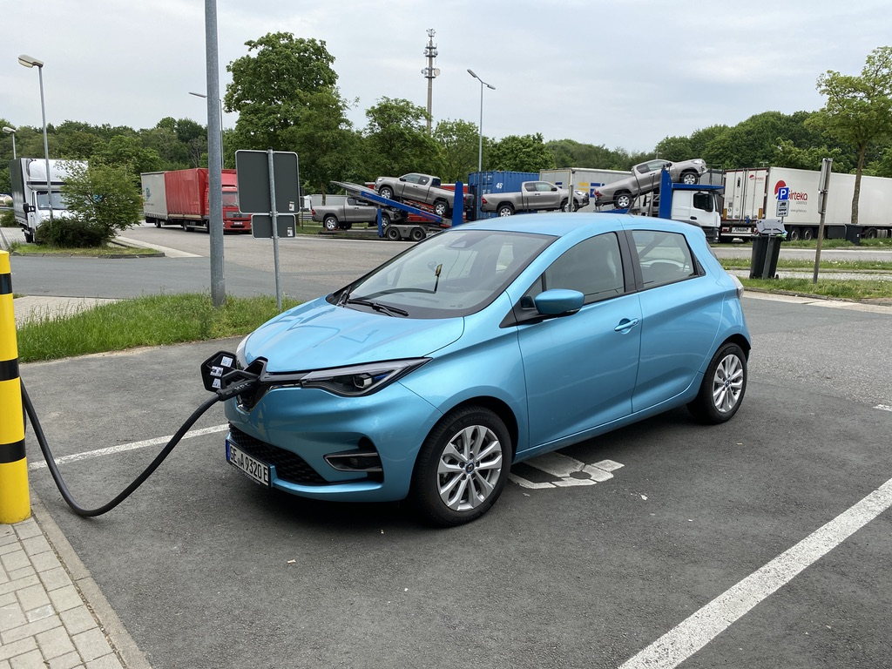
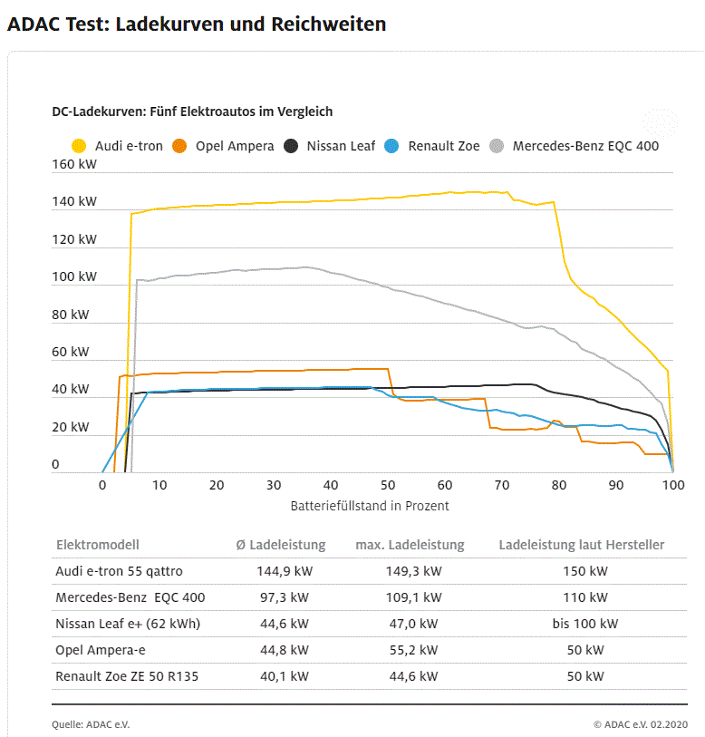
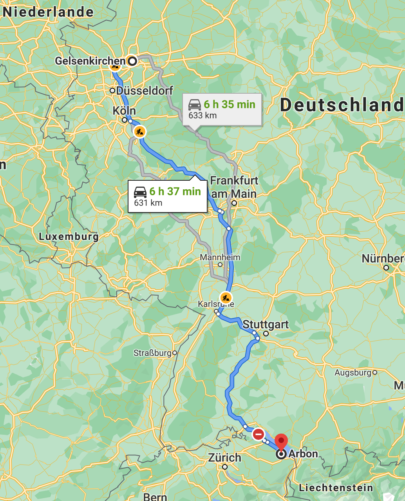
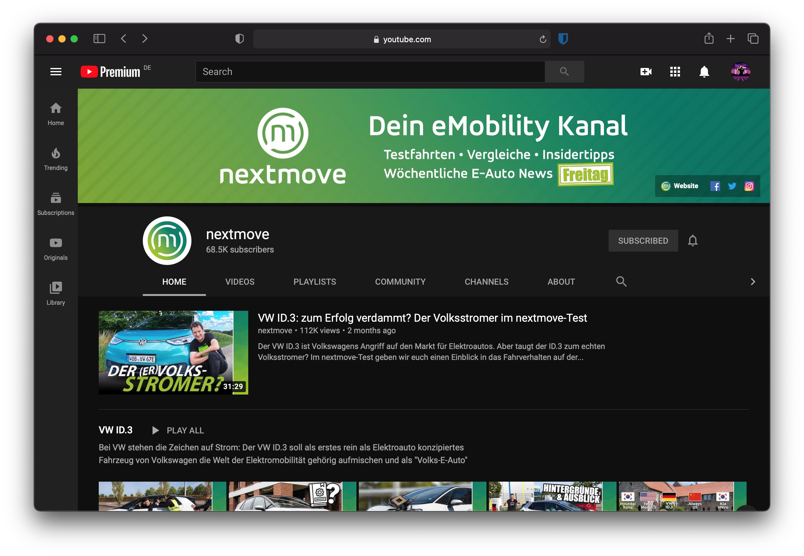
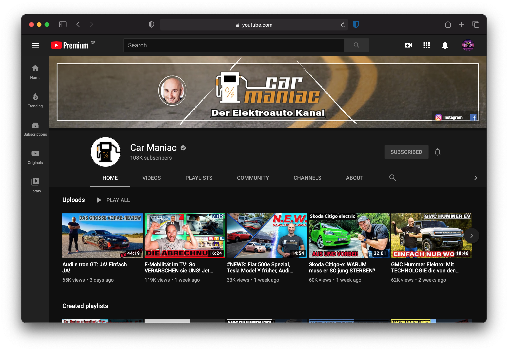
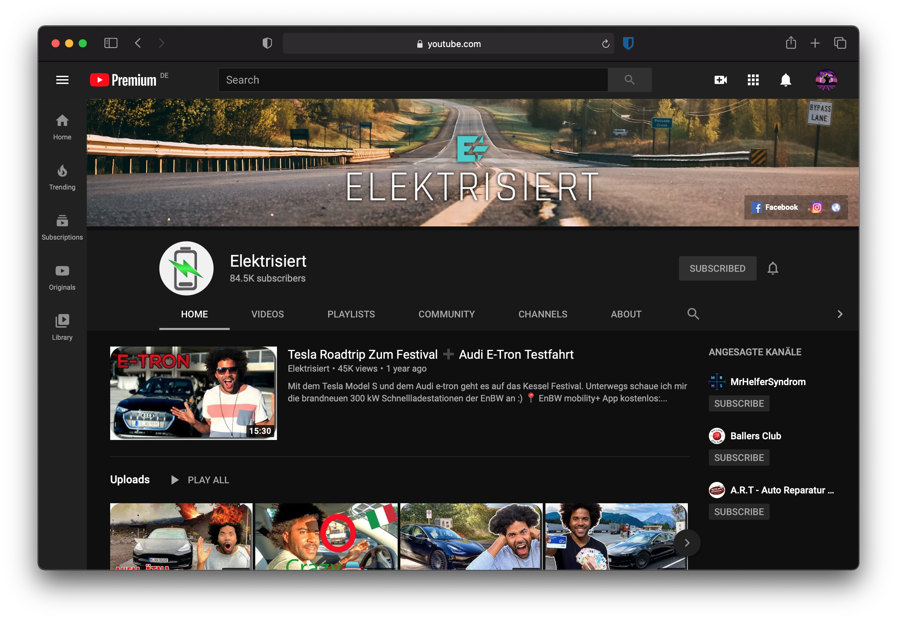
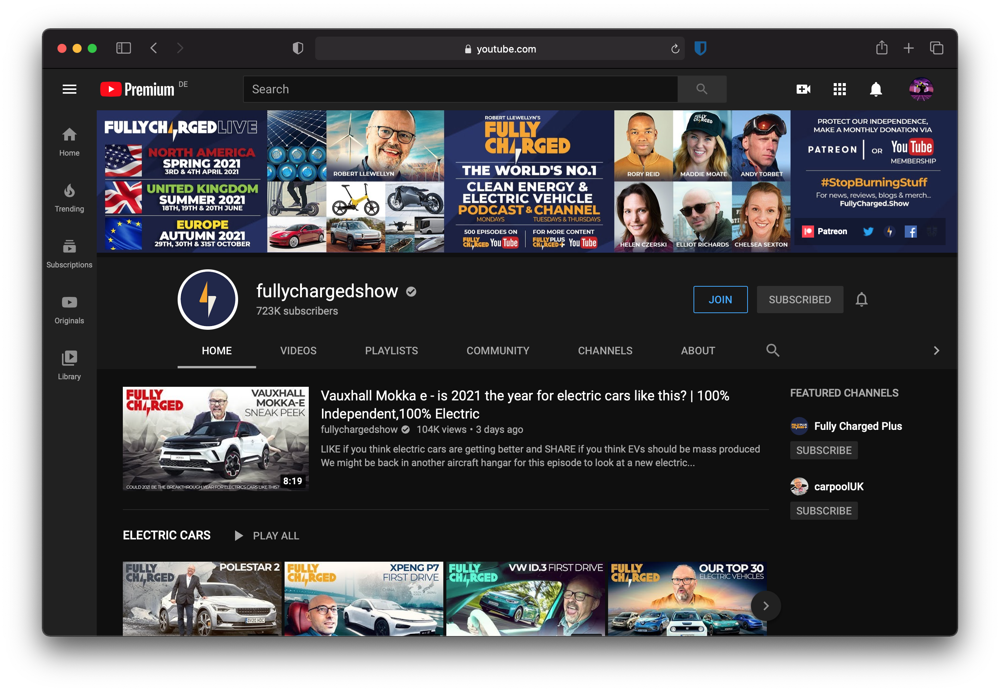

# 🚙 Electric Cars ⚡️
## A status report after 6+ months as a full-time "e-mobilist"

Raphael Guntersweiler
<raphael@guntersweiler.net>

---

# Talking points
- Owning & driving an electric car (vs. ICE car)
- Charging
    - Basics
    - Infrastructure
- Some good tips & tricks
- Questions?

---

# Some jargon upfront
- **ICE** - Internal Combustion Engine
  (basically any _regular_ car)
  🇩🇪 "_Verbrenner_"
- **EV** - Electic Vehicle
  - **BEV** - Battery EV
  - **PHEV** - Plug-in Hybrid EV (with ICE)
  - **FCEV** - Fuel Cell powered EV (i.e. Hydrogen cars)
  - **sHEV** / **mHEV** - strong / mild Hybrid EV ("alabi EV", cannot be plugged in, battery range very limited; combined with ICE)

Helpful info: https://www.opel.de/einfach-elektrisch/uebersicht/bev-phev-wofuer-stehen-die-abkuerzungen.html

---

# ℹ️ Disclaimer
This talk focuses on the current state as of November 2020 in Germany.

Some of the points might not be applicable anymore or in other countries.

Tesla's are great, but expensive and too easy. A.k.a.: No Tesla in this presentation!

## ⚠️ **Opinions ahead!** (_duh!_)

---

<!-- _class: full-screen-image -->

**Renault Zoé R110 Z.E.50 (2020)**
_also called "Renault Zoé Phase II"_
100 kW / 135 bhp / 52 kWh net
395 km WLTP / ø 17.2 - 20 kWh/100km

---

# The price

List price as shown:
- **~€ 33,000**, incl. battery
- **~€ 25,000**, with battery lease
  - lease based on km driven
  - € 75 / month – 7,500 km
    up to € 120 / month – unlimited
    +€ 0.042 / km extra

_not included: government funding (D in 2020: up to **€ 10,000**!!!)_

Personal recommendation: **Lease your new EV!**
_We currently live in a time where EVs are changing about as fast as smartphones. The competitive car today can be "bad" in a few years._

---

# Owning an electric car
## My situation
- no garage
- no carport
- no private driveway
- = no private charging port
  🇩🇪 _"Laternenparker"_

But:
- ☑️ can charge at work (commute: < 10km)
- ☑️ next public charging station: 🚶 < 15min
- ☑️ supermarket with (free!) charging station in range

---

# Driving an electric car
- drives like an _Automatic_ except:
    - no gear changes (because _no gears_)
    - 🤫 silent*
    - quick acceleration
    - breaking _recharges_ your battery! 🔋⚡️
      _recuperation_ / 🇩🇪 _Rekuperation_
    - highly efficient in city environments
      _very low energy consumption_
    - zero CO2 emissions
    - cheaper in upkeep (e.g. no oil, coolant, exhaust, etc. to maintain)

---

# Driving an EV
## 😕 The Negatives
- less range than ICE cars
- longer "fuel stops"
- charging is not always as straight forward as refueling (see _Infrastructure_)

_These points are very car-dependant._

⚠️ Driving an electric car requires you to **unlearn some habits** and **relearn** some new ones.

---
<!-- _class: invert -->

# ⚡️ Charging
## How do I even charge this thing?

---

# First some theory: **Plugs & Sockets**
- Type 2
- CCS
- CHAdeMO
- CEE
- Household socket

---

# Type 2

- found almost everywhere
- found on almost every car
- can charge up to **22kW AC** (sometimes 43kW AC)
- commonly provided by city charging points

This is also called the _Mennekes_ plug.

---

# CCS

- found at high-speed / fast chargers (e.g. at highway rest stops)
- not all cars have it (but most these days do)
- can charge up to **300kW DC**

These are your friend on long-distance trips!

---

# CHAdeMO

- developed in Japan
- found on older electric cars
- can charge up to **50kW DC**

This plug is starting to be replaced in favour of Type 2.

---

# CEE

- "camper plug" / "industrial plug"
- only with adapters / mobile charging boxes
- only delivers:
    - _blue_: **3.7kW AC** (230V, 16A)
    - _red_: **11kW AC** (400V, 26A)

_If you upgrade your garage, you should get this and a supported wallbox._

---

# Household sockets (i.e. Schuko)

- "it delivers energy..."
- recommended: up to **2.3kW AC** (230V, 10A)
- if equipped: up to **3.7kW AC** (230V, 16A)

_If you have it in your garage, you can use it to keep your car charged up._

---

# Next: **Charging power**

Know your cars limits

Example: _Renault Zoé_
- Type 2: up to **43kW**
- CCS: up to **50kW**

A CCS hyper-charger with up to 300kW DC won't charge your car faster, if you can only draw 50kW.

---

# And finally: **Charging curves**

**Cars won't charge with full power all the time**!
This would shorten the life span of the battery.

**Charging speeds usually drop off after reaching _~80% SoC_.**
Check the internet or test yourself. This can be good information to know for long-distance trips.

**Pro tip for long-distance trips: _Never charge to 100% SoC._**
Charging the last 20% can take about as long as the first 60-80%. Waiting for 100% usually _wastes time_.

Also: Don't wait too long before charging up. This could bite you.

---

---

<!-- _class: invert -->

# Scenario: **~630 km to Switzerland**

modern Petrol or Diesel cars can finish this route with ~1 tank of fuel*

---

## **Scenario**: Known values _Petrol car_ (experience)

- 2006 Seat Ibiza 1.4l (~100bhp, ø ~7l Petrol / 100km, ~_40l_, Vmax=195km/h)
  - "eco drive" (Vmax: <130km/h): no fuel stop needed
  - average: refuel _once_, less than 50% tank volume required
  - load: ~3-4 people (equivalent)

### Cost
- **fuel**: 50l petrol / € 1.229 = **€ 61.45**
- **time**: ~8-10h (_incl. breaks, traffic, etc._)

---

## **Scenario**: Known values _Electric car_ (tested twice)

- 2020 Renault Zoé R115 Z.E.50 (~100bhp, ø ~17kWh / 100km, 50kWh, Vmax=140km/h)
  - Vmax: ~125 km/h
  - 3-4 charging stops (~40min each)
  - load: ~1-2 people (equivalent)
  - Weather: dry, sunny, warm (~22°C), A/C on

### Cost
- **electricity**: ~92kWh / € 0.39 = **€ 35.88**
- **time**: ~10-11h (_incl. charging stops, breaks, traffic, etc._)

---

## The differences: ⛽️ vs. ⚡️
- longer travel time
- lower speed
- longer breaks

## But:
- less "fuel" cost
- _less stress_
- 🍃 **0g CO2**!

---

## The key: **Preparation & Strategy**
_Depending on the car, this might be more or less of a problem._

Important stats to know:
- Battery capacity
- max. charging speed

Good to know:
- expected load (passengers & load)
- weather condition

With these parameters you can then setup your "charging strategy".

A good tool for this is [eCalc.ch](https://www.ecalc.ch/evcalc.php).

---

## **Scenario**: The strategy
- Charge limit: 80%
- Recharge at ~30%
- Travel speed: ~125 km/h

### ⚠️ Important!
Plan for the Unplannable.
- 1 Charging Station out of order!

---

# How charging (and _payment_) works
Most public charging stations can be operated in one of these ways:
- on-the-fly payment
  - contactless payment (EC, credit card)
  - online payment (website or app)
- contract payment
  - NFC card / badge
  - app
- _free_

---

## Good to know
**Talk to your energy supplier about EV contracts ("_Autostrom-Tarif_")**

_ELE_ has some contracts that include free charging with _innogy_ city chargers

➡ For day-to-day commutes, I spend _**~0€ per month**!!_

---

## Recommendation: **EnBW mobility+**
With EnBW you can charge **for the same price** in **Germany, Austria, Switzerland, Netherlands, France and Italy**.

If you are an ADAC member, EnBW provides you the free _eCharge tariff_ which gives you the same benefits as payed memberships and a free card.

| Tariff           | Fee / month | Cost / kWh (AC/DC) |
|:-----------------|------------:|-------------------:|
| Default          | € 0.00      | € 0.39 / € 0.49    |
| EnBW customer    | € 0.00      | € 0.29 / € 0.39    |
| Frequent charger | € 4.99      | € 0.29 / € 0.39    |
| ADAC eCharge     | € 0.00      | € 0.29 / € 0.39    |

---

## Alternatives
- **fastned** (mostly _NL_, some in _D_)
  - known for fast chargers
  - ~€0.58 / kWh (free tier), ~0.34 / kWh (Gold member, €11.69 / M)
  - Benefit: can recognize car after first charge, no start over app required anymore
- **Shell Recharge** (known to work in NL, Belgium)
  - reliable fallback, works almost everywhere
  - can be initiated via (NFC) card
  - rates vary (~0.35€ / kWh AC, ~0.59€ / kWh DC, sometimes additional fees)

---

<!-- _class: invert -->

# Apps

---

## App recommendations
- **ABRP: A Better Route Planer**
  electric car focused route planner that includes charging stops suited for the car
  estimates battery SoC (_pretty accuratley_)
- **AirElectric**
  Charger map, also lists a lot of free chargers
- **eCalc.ch / evCalc**
  Advanced route planner, provides detailed input dials to tweak, detailed report and recommendations for travel speeds 

---

<!-- _class: invert -->

# Sources for more info

---

<!-- _class: full-screen-image -->

🇩🇪
German EV rental company
News, Reviews and Tests

https://nextmove.de
https://www.youtube.com/nextmovevideos

---

<!-- _class: full-screen-image -->

🇩🇪
German EV enthusiast
Reviews, Tests, News and Vlogs

https://www.youtube.com/carmania_chris

---

<!-- _class: full-screen-image -->

🇩🇪
German Tesla owner and EV enthusiast
Vlogs around live with a Tesla, Roadtrips, experiments and occasional test drives

https://www.youtube.com/Elektrisiert

---

<!-- _class: full-screen-image -->

🇬🇧
English e-mobility channel
Reviews, News, Podcast
_community funded_

https://www.youtube.com/fullychargedshow

---

<!-- _class: invert -->

# Any questions?

---

<!-- _class: invert -->

# Thank you for your attention!

Raphael Guntersweiler
raphael@guntersweiler.net
